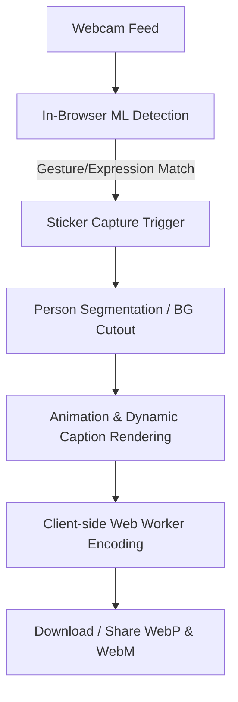

# Product Requirements Document (PRD)
## Meme Verse 2.0: Selfie-to-Sticker Engine

---

## 1. Overview & Problem Statement

### 1.1 Executive Summary
"Meme Verse 1.0" successfully proved the concept of real-time, browser-based Machine Learning (ML) for meme interaction by mapping webcam-detected expressions and gestures to static images. However, the app suffered from significant reliability gaps (such as lack of camera permission handling, no face/hand fallback mechanisms, and lost statistics upon refresh) and limited engagement due to static, non-personalized content.

**Meme Verse 2.0** is a complete client-side rebuild designed to transform the product from a passive viewer into a personalized **Selfie-to-Sticker creation engine**. Users will be able to capture their own reactions, automatically segment themselves from the background in-browser, overlay gesture-responsive captions and animations, and export high-quality animated stickers compatible with major messaging platforms (WhatsApp and Telegram)—all without their data ever leaving their device.



### 1.2 Problem Statement
Existing sticker generation tools require either manual, tedious background tracing or sending photos to external servers, which compromises user privacy. Furthermore, existing browser ML models are often resource-heavy, causing UI freezing or failures on budget devices. Meme Verse 2.0 solves this by implementing an offline-first, performance-capped client-side pipeline utilizing Web Workers and fallback mechanisms, delivering a premium and reliable sticker-making experience.

---

## 2. Goals and Success Metrics

### 2.1 Business & Product Goals
*   **Privacy-First Customization:** Establish a high-fidelity personalization tool where 100% of the image processing, ML inference, and media encoding happens client-side.
*   **Virality & Shareability:** Enable seamless sharing of dynamic reaction stickers directly into active chats.
*   **Product Reliability:** Upgrade the system to handle hardware, environment, and user errors gracefully, avoiding blank screens or frozen loading indicators.

### 2.2 Key Performance Indicators (KPIs) & Quality Metrics

| Metric | Target | Measurement Method |
| :--- | :--- | :--- |
| **ML Load-to-Ready Time** | $\le 5$ seconds (on average 4G connections) | Performance API timestamp tracking |
| **Inference Frame Rate** | $\ge 20$ FPS (mid-range mobile); $\ge 30$ FPS (desktop) | Live FPS counter in debug panel |
| **Segmentation Time** | $\le 1.5$ seconds (fallback to rect-crop if $> 3.5$s) | Performance mark & measure |
| **Export File Size** | Static WebP: $< 100\text{KB}$; Animated WebP: $< 500\text{KB}$ | File blob validation before download |
| **Conversion Rate** | $\ge 45\%$ of sessions leading to $\ge 1$ sticker download | Local anonymized funnel telemetry (optional/local logs) |
| **Recovery Rate** | $100\%$ recovery from camera permission rejection | Automated UI state test verification |

---

## 3. Target Users / Personas

### 3.1 Persona A: "The Group Chat Catalyst" (Shreya, 21)
*   **Context:** Constantly chats on WhatsApp and Telegram. Loves using custom memes and hyper-local reactions.
*   **Need:** Fast, highly personalized reaction stickers that capture her specific gestures/moods instantly.
*   **Pain Point:** Creating custom stickers takes too many steps (requires a separate background eraser app, transfer tools, and formatting).

### 3.2 Persona B: "The Privacy Enthusiast" (Marcus, 34)
*   **Context:** Active on secure messaging channels; suspicious of apps requiring photo uploads.
*   **Need:** Fun visual tools that run entirely locally.
*   **Pain Point:** Most modern AI filters process images on the cloud, exposing raw camera streams to third parties.

---

## 4. Scope: In Scope vs. Out of Scope

To ensure a rapid and focused release cycle, the feature set is prioritized into Phase 1 (Core Release), Phase 2 (Enhancements & Sharing), and Phase 3 (Gamification & Polish).

### 4.1 In Scope
*   **Real-time Hand & Face ML Tracking:** Dual inference pipelines running concurrently.
*   **Client-side Person Segmentation:** Isolating the person from the background to produce a transparent PNG/WebP frame stack.
*   **Sticker Rendering Engine:** Applying CSS/Canvas animations (Wiggle, Shake, Pulse) and auto-contrasting text.
*   **Multi-format Sticker Exporter:** Building compliant static WebP, animated WebP, and WebM (VP9) files within Web Workers.
*   **Persistent Statistics & Gamification:** Saving streak data, achievement counts, and usage stats in local storage.

### 4.2 Out of Scope (Deferred to Future Phases)
*   *Cloud Sync / Database integration:* System remains 100% serverless; sticker backups or syncing across devices will not be supported.
*   *Audio-reactive Stickers:* Exporting stickers with sound is excluded, matching Telegram and WhatsApp animated sticker specs.
*   *Direct Platform App Publishing API:* Due to sandboxed mobile platform constraints, direct integration into WhatsApp's internal storage must be performed using standard system sharing (Web Share API) or ZIP exports that users import via sticker installer apps.

---

## 5. Feature Requirements

### 5.1 Category 1: Core Selfie-to-Sticker Pipeline

#### FEAT-1.1: Multi-Format Live Camera Capture
*   **User Story:** As a user, I want to see a real-time mirror preview of my camera and capture a still photo, so that I can freeze a specific reaction frame for my sticker.
*   **Acceptance Criteria:**
    *   App displays a mirror preview (horizontal flip) of the webcam stream.
    *   Clicking "Capture" or trigger gesture locks the frame.
    *   Provides a "Retake" option that immediately restarts the live camera stream.

#### FEAT-1.2: Client-side Background Removal (Person Segmentation)
*   **User Story:** As a user, I want my photo to be cut out from the background automatically, so that the exported sticker has a transparent background like standard stickers.
*   **Acceptance Criteria:**
    *   Segmentation model extracts the foreground person with a clean alpha mask.
    *   Processes within $1.5$ seconds on standard devices.
    *   If processing exceeds $3.5$ seconds, the app displays a soft alert and falls back to a neat rounded-rectangle crop of the user's face to avoid locking the UI.

#### FEAT-1.3: Gesture-Driven Style & Animation Mapping
*   **User Story:** As a user, I want my detected gesture/expression to automatically select a matching sticker caption, font style, and looping animation, so that the sticker conveys my vibe without manual editing.
*   **Acceptance Criteria:**
    *   The app reads a configuration JSON file to determine style mappings.
    *   Applies a loop animation (e.g., "Angry" $\rightarrow$ *Shake*; "Thumbs Up" $\rightarrow$ *Bounce*; "Peace" $\rightarrow$ *Wiggle*).
    *   Draws meme text with a high-contrast outline (black stroke on white text or vice-versa) to ensure readability on both dark and light chat backgrounds.

```
Animation Mapping Spec:
- Angry      -> Vibration / Shake
- Smile      -> Gentle Zoom-Pulse
- Shh/OK     -> Wave / Slide-in
- Peace/Rock -> Wiggle / Rotation
```

#### FEAT-1.4: Multi-Format Sticker Exporter
*   **User Story:** As a user, I want to download my sticker in formats compatible with Telegram and WhatsApp, so that I can use them natively in chats.
*   **Acceptance Criteria:**
    *   **WhatsApp Static:** Generates a WebP image ($512 \times 512$ px, $\le 100\text{KB}$, transparent background).
    *   **WhatsApp Animated:** Generates a looping WebP animation ($512 \times 512$ px, $\le 500\text{KB}$, max 3 seconds long, target 8 FPS).
    *   **Telegram Animated:** Generates a VP9 WebM video ($512 \times 512$ px, max 3 seconds, no audio track, transparent background).

---

### 5.2 Category 2: Expanded Detection System

#### FEAT-2.1: Extended Gesture & Expression Vocabulary
*   **User Story:** As a user, I want the app to detect additional expressions and gestures, so that I can make a wider variety of meme stickers.
*   **Acceptance Criteria:**
    *   Detects standard gestures: *Thumbs Up, Fist, OK, Shh, Peace, Rock, Call Me, Wave, Pinch*.
    *   Detects expressions: *Smile, Tongue Out, Angry, Sad, Surprised, Wink*.

#### FEAT-2.2: Combination (Combo) Triggers
*   **User Story:** As a user, I want to perform a gesture and an expression simultaneously to trigger a special hidden meme layout, so that the app feels interactive and gamified.
*   **Acceptance Criteria:**
    *   Detecting both a gesture and expression simultaneously (e.g., *Wink + Peace* or *Angry + Fist*) overlays custom combo graphics (e.g., anime sparkles, fire effects) and a specific preset caption.

#### FEAT-2.3: Configuration-Driven Mapping (JSON Config)
*   **User Story:** As an administrator/developer, I want the gesture-to-meme mappings to be loaded from a JSON configuration file, so that new memes can be added without changing the core application codebase.
*   **Acceptance Criteria:**
    *   Application configuration is stored in a clean `meme_mappings.json` file.
    *   Allows configuration of text templates, CSS animation properties, font classes, and colors.

---

### 5.3 Category 3: Sticker Pack & Sharing Suite

#### FEAT-3.1: Session Sticker Gallery & Pack Bundler
*   **User Story:** As a user, I want to save multiple stickers to a local session gallery and export them as a single ZIP file, so that I can easily import a pack of stickers into WhatsApp.
*   **Acceptance Criteria:**
    *   Maintains an in-session tray showing all stickers generated during the visit.
    *   Provides a "Download Pack" button which zips the WebP stickers together.
    *   Generates a mandatory $96 \times 96$ px `tray_icon.webp` inside the ZIP file to meet WhatsApp pack installation guidelines.

#### FEAT-3.2: Direct Sharing via Web Share API
*   **User Story:** As a mobile user, I want to share my sticker directly to my messaging apps using my device's native sharing sheet, so that I don't have to navigate my local file browser.
*   **Acceptance Criteria:**
    *   Checks browser support for `navigator.share` with file arguments.
    *   If supported, "Share" triggers the OS native share dialog, passing the exported WebP/WebM file as a shared attachment.
    *   If unsupported, gracefully falls back to a clean download action with an on-screen visual guide on how to copy/paste the sticker.

---

### 5.4 Category 4: Reliability, Performance & Fallbacks

#### FEAT-4.1: Permission Recovery & Diagnostics UI
*   **User Story:** As a user, I want to receive clear instructions on how to enable camera permissions if they are blocked, so that I don't get stuck on a loading screen.
*   **Acceptance Criteria:**
    *   Detects camera access errors (`NotAllowedError`, `NotFoundError`, `NotReadableError`).
    *   If blocked, replaces the camera stream with a user-friendly diagnostic window detailing step-by-step resolution instructions for iOS Safari, Chrome, and Android.
    *   Presents a "Retry Connection" button after instructions.

#### FEAT-4.2: Inference Debouncing & Custom Sensitivity
*   **User Story:** As a user, I want to adjust the gesture recognition sensitivity and have the detection debounced, so that the meme frame isn't triggered by jittery or accidental movements.
*   **Acceptance Criteria:**
    *   Implements a temporal debounce threshold (model must detect gesture consistently for $\ge 300\text{ms}$ before changing states).
    *   Includes a settings slider to adjust the ML prediction confidence threshold (from $0.4$ to $0.95$, defaulting to $0.75$).

#### FEAT-4.3: Multi-Threaded Off-Main-Thread Processing
*   **User Story:** As a user, I want the background extraction and sticker encoding to run in the background, so that the main web interface remains smooth and responsive.
*   **Acceptance Criteria:**
    *   Offloads background removal parsing and frame-by-frame WebP/WebM compression to a Web Worker.
    *   Maintains an active, non-blocking CSS loader on the main thread displaying progress percentages (e.g., "Processing: 45%").

---

### 5.5 Category 5: Stats & Gamification

#### FEAT-5.1: Persistent Statistics Dashboard
*   **User Story:** As a user, I want my cumulative gesture and expression statistics to persist between browser refreshes, so that I can track my long-term usage.
*   **Acceptance Criteria:**
    *   Saves statistics (Total Stickers Created, Most Used Gesture, Most Used Expression) to `localStorage` or `IndexedDB`.
    *   Provides a "Reset Stats" button inside a confirmation modal.

#### FEAT-5.2: Streak and Achievement Badges
*   **User Story:** As a user, I want to unlock badges for completing sticker creation streaks or experimenting with different gesture combos, so that using the app feels rewarding.
*   **Acceptance Criteria:**
    *   Calculates daily visit streaks based on local timestamps.
    *   Triggers interactive toast animations when unlocking achievements (e.g., *"Combo Master"* - trigger 3 different combo memes; *"Sticker Machine"* - export 10 stickers).

---

### 5.6 Category 6: UX Polish

#### FEAT-6.1: Theme Toggle (Dark/Light Mode)
*   **User Story:** As a user, I want to toggle between dark and light themes, so that the app is comfortable to use in low-light environments.
*   **Acceptance Criteria:**
    *   Implements dark and light stylesheets using CSS Custom Properties.
    *   Respects system settings via `prefers-color-scheme` on first load, with a manual toggle in the navigation header.

#### FEAT-6.2: Interactive Onboarding Tutorial
*   **User Story:** As a new user, I want an interactive guide that shows me the supported gestures and expressions, so that I can learn how to trigger different memes.
*   **Acceptance Criteria:**
    *   First-time visitors see an optional visual onboarding overlay.
    *   Prompt asks the user to match a specific gesture (e.g., "Show a Thumbs Up") and highlights the camera frame green once the model successfully detects it.

---

## 6. User Flows

### 6.1 Happy Path: Open App to Sticker Export
```
[User Lands on App]
       │
       ▼
[Camera Permission Prompt] ──(Granted)──► [Live Camera Mirror View]
                                                 │
                                                 ▼
                                        [Perform Gesture]
                                 (e.g., Peace Sign + Wink Combo)
                                                 │
                                                 ▼
                                    [Target Detected / Hold]
                                        (300ms Debounce)
                                                 │
                                                 ▼
                                       [Auto Capture Frame]
                                                 │
                                                 ▼
                                      [Segmentation Processing]
                                   (Worker removes background)
                                                 │
                                                 ▼
                                     [Interactive Sticker Edit]
                                 (Live Preview + Caption adjustment)
                                                 │
                                                 ▼
                                          [Click Export]
                                (Worker builds WebP/WebM file)
                                                 │
                                                 ▼
                                   [Download / Web Share API]
```

### 6.2 Edge Case Flow: Camera Permission Denied
```
[User Lands on App]
       │
       ▼
[Camera Permission Prompt] ──(Denied)──► [Display Diagnostics Panel]
                                                 │
                                                 ▼
                                       [Platform Custom Help]
                                  (Guides for Chrome/Safari/iOS)
                                                 │
                                                 ▼
                                     [User Enables Camera in Settings]
                                                 │
                                                 ▼
                                        [Clicks 'Retry' Button]
                                                 │
                                                 ▼
                                       [Re-initialize Stream]
```

---

## 7. Technical Considerations & Constraints

### 7.1 Architecture Overview
The application is fully client-side. The stack comprises static HTML5/CSS3, vanilla TypeScript (compiled to modern ES6 modules), and browser-native ML libraries.

```
┌────────────────────────────────────────────────────────┐
│                      Client Browser                    │
│                                                        │
│  ┌───────────────────┐        ┌─────────────────────┐  │
│  │    Main Thread    │        │  Web Worker Thread  │  │
│  │                   │        │                     │  │
│  │ ┌───────────────┐ │        │ ┌─────────────────┐ │  │
│  │ │ MediaPipe ML  │ │        │ │   Background    │ │  │
│  │ │  Inference    │ │        │ │   Extraction    │ │  │
│  │ └───────┬───────┘ │        │ └────────┬────────┘ │  │
│  │         │         │ Transfer │        │          │  │
│  │         ▼         ├─────────►│        ▼          │  │
│  │ ┌───────────────┐ │ Frame    │ ┌─────────────────┐ │  │
│  │ │ Canvas Render │ │ Data     │ │   WebP/WebM     │ │  │
│  │ │   & Captions  │ │          │ │   Encoding      │ │  │
│  │ └───────────────┘ │          │ └────────┬────────┘ │  │
│  │         ▲         │◄─────────┤          │          │  │
│  │         │         │ Finished │          ▼          │  │
│  │ ┌───────┴───────┐ │ Blob     │ ┌─────────────────┐ │  │
│  │ │ UI / Gallery  │ │          │ │ ZIP Compression │ │  │
│  │ └───────────────┘ │          │ └─────────────────┘ │  │
│  └───────────────────┘        └─────────────────────┘  │
└────────────────────────────────────────────────────────┘
```

### 7.2 Core Model & Inference Architecture
To achieve concurrent detection without crashing mobile browsers, lightweight model architectures must be selected:
1.  **Face & Expression Detection:** *MediaPipe Face Mesh* or a compact *TensorFlow.js FaceLandmarks* model.
2.  **Hand Gesture Tracking:** *MediaPipe Hands* (utilizing the lite model configuration).
3.  **Background Segmentation:** *MediaPipe Selfie Segmentation* or *BodyPix* configured with a lightweight MobileNetV1 backbone.
*   **Model Caching:** Configure service workers or utilize standard Cache Storage APIs to cache binary model weights after the initial fetch, enabling offline capability.

### 7.3 Multi-threaded Frame Export
*   **Web Workers:** Raw ImageData arrays of the captured loop must be copied and transferred to the worker thread using Transferable Objects to minimize memory footprint.
*   **Wasm-based Muxers:** Native Javascript libraries or compiled WebAssembly modules (e.g., `libwebp` wrapper or `webm-muxer`) will run in the Web Worker to assemble output files.

---

## 8. Non-Functional Requirements

### 8.1 Performance & Resource Allocation Budgets
*   **Max CPU Usage:** $\le 70\%$ of a single core during continuous detection.
*   **Max RAM Footprint:** $\le 120\text{MB}$ including loaded model weights.
*   **Asset Sizes:**
    *   Core bundle size (HTML, CSS, JS): $< 400\text{KB}$ gzipped.
    *   ML Model Weights (compressed): Combined total $< 8\text{MB}$.

### 8.2 Privacy & Security
*   **Zero Server Transmission:** Raw imagery, webcam frames, and segmented photos are stored in volatile RAM only. No server uploads are permitted.
*   **Anonymized Analytics:** If basic usage statistics are collected globally, no images, biometric patterns, or face-mesh markers may be included.

### 8.3 Accessibility (a11y)
*   **Keyboard Controls:** Every action (Capture, Retake, Export, Theme Toggle) must be accessible via keyboard shortcuts (e.g., Spacebar for capture).
*   **Screen Reader Labels:** All dynamic UI elements require explicit `aria-label` properties.
*   **Camera Fallback Path:** A dedicated upload modal allows users to select a pre-recorded photo/video file from their local drive instead of using the webcam.

### 8.4 Browser Support Matrix
*   **Mobile Browsers:** Safari on iOS 15+, Google Chrome / Samsung Internet on Android 10+.
*   **Desktop Browsers:** Google Chrome, Mozilla Firefox, Safari, Microsoft Edge (latest 2 major versions).

---

## 9. Milestones / Phased Roadmap

```
Phase 1: Foundations & Reliability ──► Phase 2: Sticker Pipeline & Sharing ──► Phase 3: UX & Gamification
(Weeks 1-4)                          (Weeks 5-8)                             (Weeks 9-12)
```

### 9.1 Phase 1: Foundations & Reliability (Weeks 1-4)
*   Setup project skeleton and service worker configuration.
*   Integrate basic MediaPipe models with permission diagnostic overlay.
*   Implement JSON-driven gesture-to-caption mapping.
*   Create live stats dashboard and persist them via `localStorage`.

### 9.2 Phase 2: Sticker Pipeline & Sharing (Weeks 5-8)
*   Develop the background segmentation logic with rectangle-crop fallback.
*   Build the CSS/Canvas animation renderer.
*   Implement Web Workers with WASM converters for animated WebP/WebM exports.
*   Integrate Web Share API and download triggers.

### 9.3 Phase 3: UX Polish, Tutorials & Gamification (Weeks 9-12)
*   Implement Dark/Light mode theme switching.
*   Build the step-by-step interactive onboarding tutorial.
*   Create achievement badges, streaks, and toast notifications.
*   Perform mobile responsive testing and optimize inference bottlenecks.

---

## 10. Risks & Open Questions

| Risk / Question | Impact | Mitigation Plan |
| :--- | :--- | :--- |
| **Heavy model download payload** on slow cellular networks. | High | Implement local model caching via Cache Storage. Display a real-time progress bar detailing download size (e.g. `2.4MB / 8.2MB`) with a retry button on network timeout. |
| **In-browser animated WebP creation speed** on low-end devices. | Medium | Use a dedicated Web Worker. Cap the frames generated at 8 FPS for a maximum of 3 seconds (24 frames total) to limit processing. |
| **Concurrent ML model processing limits** (Face + Hand tracking simultaneously running). | High | Stagger inference: run face landmarks every frame, but throttle hand tracking to every second or third frame if the FPS drops below 15. |
| **WhatsApp Import Constraints:** Dynamic WA stickers require third-party apps for direct installation. | Medium | Provide explicit on-screen visual tutorials teaching the user how to copy the WebP sticker directly into their device clipboard or use free helper apps. |

---

## 11. Appendix: Glossary

*   **WebP:** An open image format developed by Google that supports both lossy/lossless compression, alpha transparency, and animations, making it the industry standard for WhatsApp stickers.
*   **WebM (VP9):** A video file format designed for web-native playback. When encoded with the VP9 codec, it supports alpha channel transparency, which is required for Telegram animated stickers.
*   **Person Segmentation (Foreground cutout):** The process of classifying each pixel in an image as either belonging to a human subject (foreground) or the surroundings (background).
*   **Debounce:** An engineering technique used to delay the execution of a function until a certain amount of time has elapsed since the last trigger event, preventing rapid, accidental double-executions.
*   **Web Share API:** A modern web browser API (`navigator.share`) that enables websites to share links, text, and files directly to native mobile applications installed on the user's operating system.
*   **Web Worker:** A browser script running in the background, parallel to the main user interface thread, allowing heavy computation without blocking page responsiveness.
